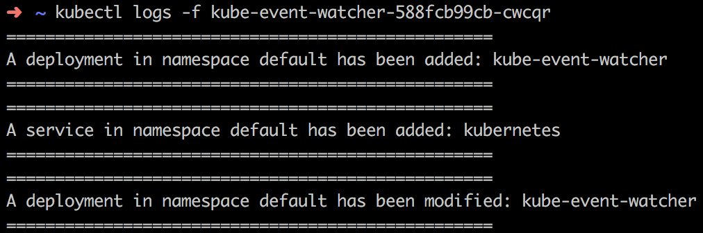

# kube-event-watcher

A Python application that watches for changes on various Kubernetes objects. Learn more about the design [here](https://www.laroberto.com/kube-event-watcher/)!

## Installation

A helm chart is already provided along with proper RBAC so installing is as easy as:

`kubectl apply -f <(helm template chart)`

Make sure you update the `values.yaml` to suit your use case.

Here's how it looks in action:



## Building from source

If you need to edit the source code, run the following commands to have the necessary dependencies:

```
virtualenv -p python3 venv
source venv/bin/activate
pip install -r requirements.txt
```

The code already accounts for runtime either inside or outside the cluster (assuming `kubectl` is configured correctly) so you can run it straight from the console.

## Configuration

| **Name**                      | **Description**                                                        | **Optional** |
| :---------------------------- | :--------------------------------------------------------------------- | :----------- |
| `NAMESPACE`                   | Target namespace to watch. Defaults to `default`.                      | Yes          |
| `WATCH_PODS`                  | Toggle to whether watch pod changes. Defaults to `False`.              | Yes          |
| `WATCH_DEPLOYMENTS`           | Toggle to whether watch deployment changes. Defaults to `True`.        | Yes          |
| `WATCH_SERVICES`              | Toggle to whether watch service changes. Defaults to `False`.          | Yes          |
| `WATCH_CONFIGMAPS`            | Toggle to whether watch configmap changes. Defaults to `False`.        | Yes          |
| `WATCH_SECRETS`               | Toggle to whether watch secret changes. Defaults to `False`.           | Yes          |
| `WATCH_SERVICEACCOUNTS`       | Toggle to whether watch serviceaccount changes. Defaults to `False`.   | Yes          |
